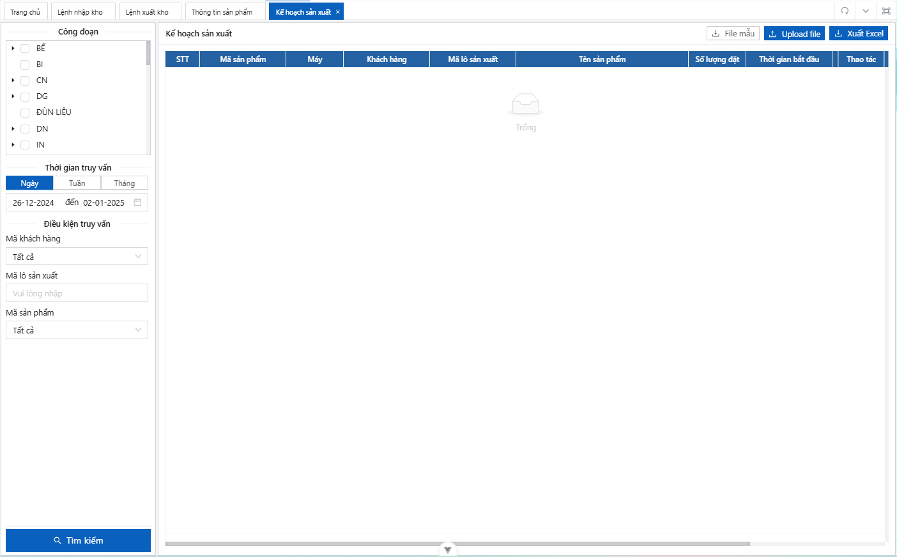

## Documentation

[Document](https://doc.vvbin.cn/)

## Preparation

- [node](http://nodejs.org/) and [git](https://git-scm.com/) - Project development environment
- [Vite](https://vitejs.dev/) - Familiar with vite features
- [Vue3](https://v3.vuejs.org/) - Familiar with Vue basic syntax
- [TypeScript](https://www.typescriptlang.org/) - Familiar with the basic syntax of `TypeScript`
- [Ant-Design-Vue](https://antdv.com/docs/vue/introduce-cn/) - ui basic use
- [Tailwind](https://tailwindcss.com) - tailwind css

## Install and use

- Config environment
```bash
cp .env.local.example .env.local
```
- Install dependencies

```bash
pnpm install
```

- run

```bash
pnpm serve
```

- build

```bash
pnpm build
```

- docker

### The dockerFile is located in the project root directory and supports differential deployment

#### build image

```bash
docker build -t vue-vben-admin .
```

#### Use environment variables to achieve differentiated container deployment. Specify service endpoint by assigning `VG_BASE_URL`. In the following example, `http://localhost:3333` is used as the back-end service address and the container is mapped to port `6666`:

```bash
docker run --name vue-vben-admin -d -p 6666:80  -e VG_BASE_URL=http://localhost:3333 vue-vben-admin
```

Then you can navigate to `http://localhost:6666`

## How to contribute

You are very welcome to join！[Raise an issue](https://github.com/anncwb/vue-vben-admin/issues/new/choose) or submit a Pull Request。

**Pull Request:**

1. Fork code!
2. Create your own branch: `git checkout -b feat/xxxx`
3. Submit your changes: `git commit -am 'feat(function): add xxxxx'`
4. Push your branch: `git push origin feat/xxxx`
5. submit`pull request`

## Git Contribution submission specification

- reference [vue](https://github.com/vuejs/vue/blob/dev/.github/COMMIT_CONVENTION.md) specification ([Angular](https://github.com/conventional-changelog/conventional-changelog/tree/master/packages/conventional-changelog-angular))

  - `feat` Add new features
  - `fix` Fix the problem/BUG
  - `style` Modify the code style/format that does not affect the feature
  - `perf` Optimization/performance improvement
  - `refactor` Refactor
  - `revert` Undo edit
  - `test` Test related
  - `docs` Documentation/notes
  - `chore` Dependency update/scaffolding configuration modification etc.
  - `workflow` Workflow improvements
  - `ci` Continuous integration
  - `types` Type definition file changes
  - `wip` In development

# Dev note
## Cấu trúc dự án
```bash
.
├── public                     # Thư mục chứa các tệp tĩnh
├── src                        # Thư mục chứa mã nguồn chính
│   ├── api                    # Thư mục chứa các API
│   │   ├── model              # Các model dùng trong API
│   │   └── sys                # Các cấu hình hệ thống API
│   ├── assets                 # Tài nguyên tĩnh (hình ảnh, font, v.v.)
│   ├── components             # Các component tái sử dụng trong ứng dụng
│   ├── design                 # Các định nghĩa liên quan đến giao diện
│   ├── directives             # Các directive tùy chỉnh
│   ├── enums                  # Các enum sử dụng trong dự án
│   ├── hooks                  # Các custom hooks
│   ├── layouts                # Các layout của ứng dụng
│   ├── locales                # File ngôn ngữ, hỗ trợ đa ngôn ngữ
│   ├── logics                 # Các logic nghiệp vụ
│   ├── router                 # Định nghĩa router cho ứng dụng
│   ├── settings               # Cấu hình dự án
│   ├── store                  # Quản lý trạng thái (state management)
│   ├── utils                  # Các hàm tiện ích (utility functions)
│   ├── views                  # Các màn hình chính của ứng dụng
│   ├── App.vue                # Thành phần chính của ứng dụng Vue
│   └── main.ts                # Entry point của ứng dụng
├── types                      # Định nghĩa các kiểu dữ liệu dùng chung
├── .dockerignore              # Tệp cấu hình loại trừ cho Docker
├── .env.local                 # Tệp cấu hình môi trường
```
## UI

- Giao diện UI: đều có `border-1 border-gray-300`
```bash
- Sidebar
- Content: Card >> BasicTable
```
- Sử dụng [Tailwind](https://tailwindcss.com)
- Bảng trong UI sử dụng component BasicTable `import { BasicTable, TableAction, useTable } from '@/components/Table'`
## OI

- Giao diện OI
- Bảng trong OI sử dụng table mặc định của Ant-design-vue

## Deploy without proxy
```bash
pnpm build
ln -s /home/domain/frontend/dist /home/domain/public_html
chown -R $USER:$USER
```
